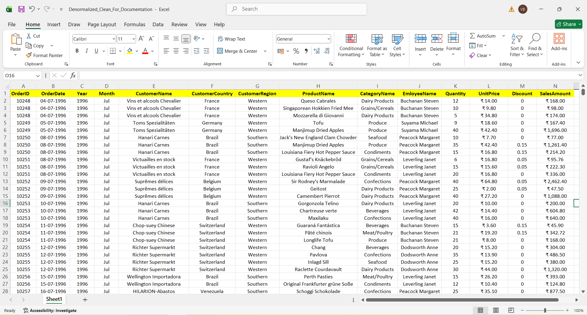
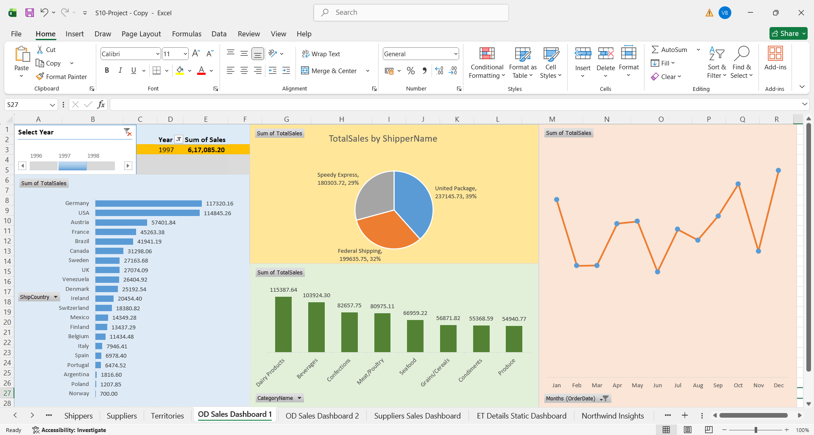
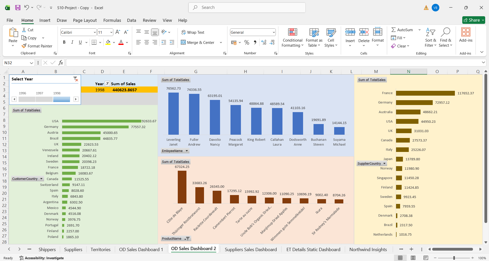
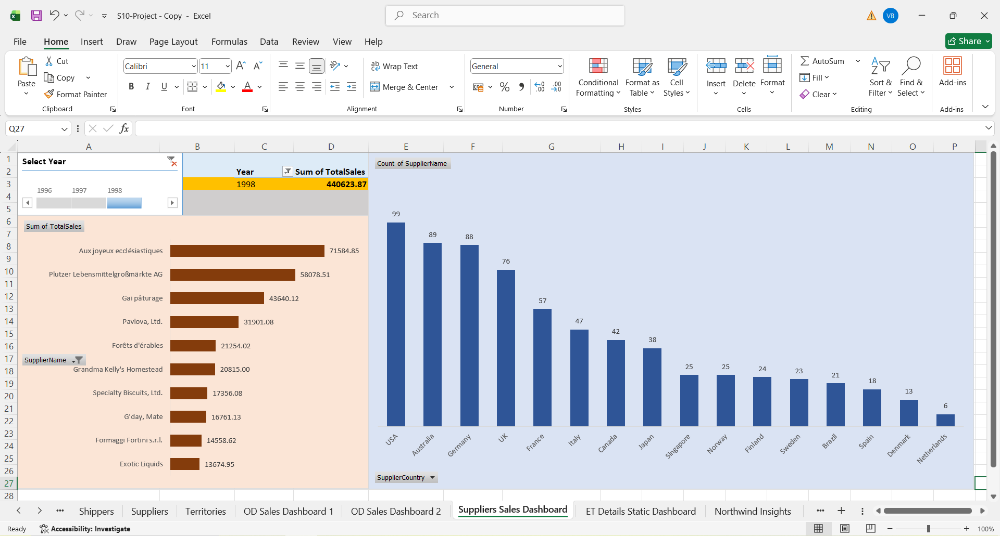
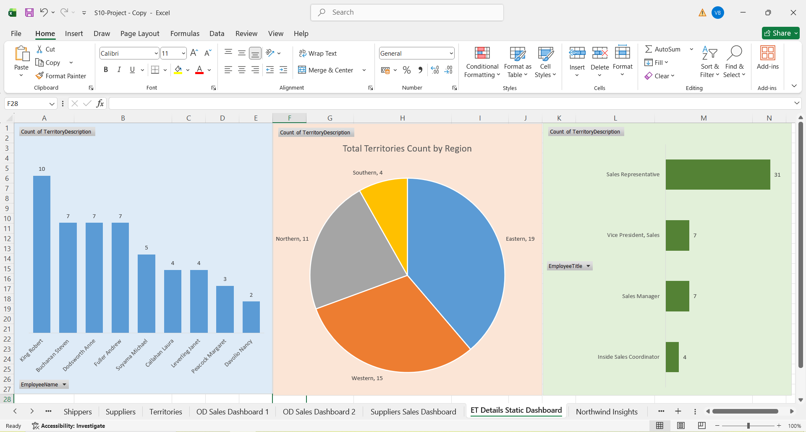
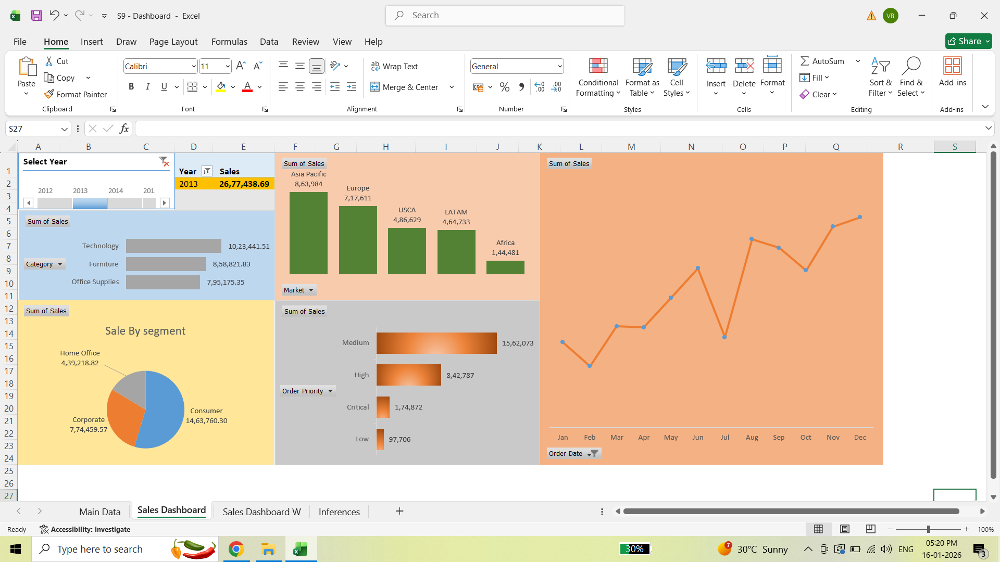

# Excel Business Dashboard & Sales Analytics

## Project Overview
This project demonstrates end-to-end business analysis and dashboard development using Microsoft Excel.  
It focuses on transforming raw relational data into a denormalized analytical dataset and building interactive dashboards to support business decision-making.

The project reflects real-world Excel-based reporting commonly used in small to mid-sized organizations where Excel serves as a primary analytical and reporting tool.

---

## Data Preparation Approach
- Source data derived from the **Northwind database**
- Multiple normalized tables were **denormalized into a single flat analytical dataset**
- Redundant and repeated columns were removed to ensure clarity and efficiency
- Calculated fields such as **Year**, **Month**, and **SalesAmount** were derived
- The final dataset was optimized for pivot-based analysis and dashboarding

This denormalized dataset acts as the **single source of truth** for all dashboards.

---

## Tools & Techniques Used
- Microsoft Excel
- Pivot Tables & Pivot Charts
- Slicers & Filters
- Calculated Fields
- Dashboard Layout & Formatting
- Business Insight Interpretation

---

## Dashboard Documentation

### 1️⃣ Denormalized Sales Dataset


**Insight:**
- Combines Orders, Customers, Products, Employees, and Categories into a single analytical table
- Eliminates the need for complex joins during analysis
- Enables faster reporting and dashboard performance

---

### 2️⃣ Order & Customer Sales Dashboard


**Insight:**
- Analyzes year-wise and country-wise sales performance
- Highlights category-level sales contribution
- Displays monthly sales trends using pivot charts
- Interactive slicers allow dynamic exploration of data

---

### 3️⃣ Employee & Product Performance Dashboard


**Insight:**
- Evaluates employee-wise sales contribution
- Identifies top-performing products by revenue
- Compares supplier country performance
- Helps assess individual and product-level impact on sales

---

### 4️⃣ Supplier Sales Dashboard


**Insight:**
- Provides supplier-wise and supplier-country-wise sales analysis
- Identifies key suppliers contributing to overall revenue
- Supports vendor performance evaluation and sourcing insights

---

### 5️⃣ Territory & Employee Static Dashboard


**Insight:**
- Displays territory distribution by region
- Shows employee role and responsibility breakdown
- Acts as a static reference dashboard for organizational overview

---

### 6️⃣ Executive Sales Overview Dashboard


**Insight:**
- Presents a high-level executive summary of sales performance
- Analyzes sales by category, segment, market, and priority
- Tracks monthly sales trends for quick decision-making
- Designed for leadership and management-level review

---

## Excel Project Files
📂 **Location:** `excel-files/`

- `excel_sales_dashboard_project.xlsx`  
  - Complete Excel project containing denormalized data, pivot tables, dashboards, and insights

- `executive_sales_dashboard.xlsx`  
  - Standalone executive-level dashboard focused on high-level sales analysis

---

## Conclusion
This project demonstrates strong Excel-based analytical capabilities, covering the complete workflow from data preparation and denormalization to dashboard creation and business insight generation.

It reflects real-world scenarios where Excel is used as a lightweight BI tool for operational reporting, stakeholder communication, and quick analysis.  
The project complements advanced analytics work performed using SQL Server, SSIS, and Power BI, showcasing versatility across the full data analytics stack.

---

## 📂 Repository Structure
```text
excel-business-dashboard/
├── README.md
├── screenshots/
│   ├── 01_denormalized_sales_data.png
│   ├── 02_od_sales_dashboard_1.png
│   ├── 03_od_sales_dashboard_2.png
│   ├── 04_suppliers_sales_dashboard.png
│   ├── 05_et_details_static_dashboard.png
│   └── 06_sales_dashboard_overview.png
├── excel-files/
│   ├── excel_sales_dashboard_project.xlsx
│   └── executive_sales_dashboard.xlsx
